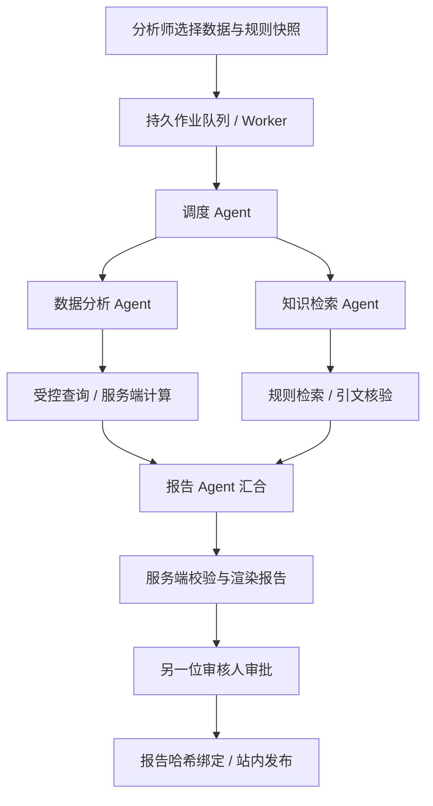

# 企业多智能体业务分析与审批平台

[在线界面](https://xiaoguos.github.io/business-insight-agent/) · [部署指南](docs/deployment.md) · [多智能体说明](docs/multi-agent.md) · [运行截图说明](docs/screenshots/README.md)

任务型业务工作台：横向导航、任务队列与新建分析分区；数据快照、规则证据、独立 Agent 轨迹和人工审批围绕同一分析任务衔接。



当前截图说明页中的图片为此前界面版本的真实运行记录，不代表本次新版布局；新版截图将在浏览器实际运行验收后替换，不使用合成图代替。

以真实订单与业务规则为输入，由四个独立 Agent 协作生成可审核报告：**Conductor → Analysis ∥ Knowledge → Report → 人工审批 → 站内发布**。

交付状态：多 Agent 主链路已实现并有自动化契约验证；**尚未完成真实生成模型与公网后端的最终业务验收，不宣称成品已交付**。GitHub Pages 仅承载前端。

## 四个 Agent，而不是四个固定处理节点

| Agent | 独立职责 | 可调用工具 | 不能做什么 |
| --- | --- | --- | --- |
| Conductor | 理解需求、分派各 Agent 目标、确定知识依赖 | 无业务工具 | 直接查订单、审批、发布 |
| Analysis | 根据独立上下文选择维度与过滤条件，查看工具结果后决策 | query_metrics | 任意 SQL、跨快照查询、改日期 |
| Knowledge | 独立检索与改写查询，选择可核验的业务规则 | search_rules | 查询订单、越租户、伪造引用 |
| Report | 汇合两路结果，选择报告重点、证据与排查建议 | inspect_metrics / inspect_evidence | 编造数字、修改源数据、审批或发消息 |

每个 Agent 拥有独立系统指令、消息历史、严格输出协议、工具白名单和调用预算。Analysis 与 Knowledge 通过 LangGraph 并行执行并显式汇合。相同底层模型可以承载不同 Agent，也可分别配置 MODEL_CONDUCTOR / MODEL_ANALYSIS / MODEL_KNOWLEDGE / MODEL_REPORT。

## 业务闭环

1. 管理员接入真实 CSV 订单与 Markdown/TXT 业务规则，导入原子提交。
2. 分析师选择不可变数据快照、时间窗口、规则快照与是否强制证据支撑。
3. 后台 Worker 从 PostgreSQL 持久队列认领，运行多 Agent，逐角色保存状态、工具调用、模型 usage 和错误。
4. 数据分析关键分支失败则停止；知识分支仅在用户政策允许时降级，并在报告披露。模型不得弱化用户的强制证据要求。
5. 数字由服务端计算，规则引用须匹配已检索原文，报告由另一位审核人确认。
6. 审批绑定 report_hash；发布事务写入发起人的站内通知，失败按作业类型重试，不能借发布重试改变已审核报告。
7. 用户可通过任务详情查询 Agent 轨迹、报告与审批状态，管理员可查审计。

## 部署与验收

见 [部署指南](docs/deployment.md)、[架构](docs/architecture.md)、[多 Agent 操作指南](docs/multi-agent.md)、[开发日志](docs/development-log.md)。

```bash
pip install ".[dev]"
alembic upgrade head
python -m scripts.bootstrap
uvicorn app.main:create_app --factory
# 另一个进程
python -m app.worker
```

生产必须配置 PostgreSQL 与真实模型服务，无浏览器假数据/规则伪装模型兜底。CI 使用 PostgreSQL 验证租约并发、完整多 Agent 协议、迁移、镜像和 API/Worker 就绪。

真实模型验收命令：`python -m scripts.acceptance --help`。该脚本要求显式 --allow-write，会导入用户指定文件并产生真实模型费用，且发布前必须人工确认。自动化测试的ScriptedModel仅位于tests/，不是产品运行模式。

## 明确边界

- 当前是单后端进程内的角色隔离多 Agent 编排，不是独立服务A2A集群；没有冒称已接入分布式A2A或生产MCP网关。
- 恢复粒度是持久作业；重试可能重新调用Agent模型。不宣称实现LangGraph节点级checkpoint恢复或模型调用exactly-once。
- 规则检索采用中文bigram和BM25，独立于项目一语义RAG；规则总量与输入大小有边界，不声称完成海量知识检索优化。
- 资料中的命令不被执行；工具权限由后端检查，但真实模型的任务理解、引用语义一致性仍需评估。
- 历史app/workflow.py、app/tools.py、app/mcp_server.py及data/样本是阶段一研究，不是生产入口；旧评估数字不能用作当前线上效果。

面试文件独立交付，不进入产品导航。
