# 企业多智能体业务分析与审批平台

围绕订单退款分析构建的多 Agent 工作平台。选择数据和业务规则快照，提交自然语言分析需求，由调度、数据分析、知识检索和报告四类 Agent 协作，结果经人工审核后发布到站内通知。

[在线访问](https://xiaoguos.github.io/business-insight-agent/) · [部署指南](docs/deployment.md) · [架构设计](docs/architecture.md) · [多 Agent 设计](docs/multi-agent.md)

## 项目背景

业务分析同时涉及数据计算、规则查阅、报告撰写和审核发布。将所有工具交给单个 Agent，容易增加上下文负担并混淆操作权限。项目按职责拆分 Agent，通过状态机与数据契约组织协作，保留人工审批环节。

## 核心功能

- 数据接入：校验并原子导入订单 CSV，为分析任务绑定不可变数据快照。
- 规则检索：接入 Markdown/TXT 业务规则，支持指定快照与强制证据要求。
- 多 Agent 协作：任务调度后并行执行分析与检索，再汇合生成报告。
- 受控分析：支持时间段对比、渠道或产品分组，由服务端计算退款指标。
- 任务追踪：记录角色状态、工具调用、模型使用量与异常，支持失败任务重试。
- 审核发布：发起人与审核人分离，审批绑定报告哈希，通过后发布站内通知。

## 技术栈

| 层次           | 技术                                            |
| -------------- | ----------------------------------------------- |
| API 与任务执行 | Python、FastAPI、独立 Worker                    |
| Agent 编排     | LangGraph、独立角色上下文、受控工具调用         |
| 数据与契约     | PostgreSQL、SQLAlchemy、Alembic、Pydantic       |
| 规则与模型     | 中文词项检索、BM25、OpenAI-compatible API       |
| 前端与部署     | ES Modules、CSS、Docker Compose、GitHub Actions |

## 多 Agent 架构

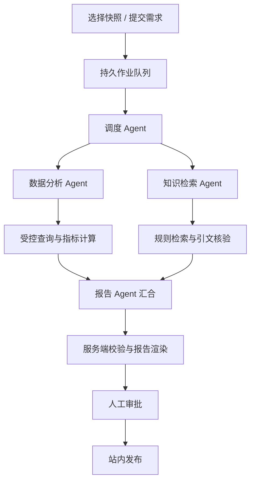

| Agent          | 职责                             | 工具                                  |
| -------------- | -------------------------------- | ------------------------------------- |
| 调度 Agent     | 理解需求，分派目标与知识依赖     | 无业务工具                            |
| 数据分析 Agent | 选择维度与查询条件，解读计算结果 | `query_metrics`                       |
| 知识检索 Agent | 检索规则，调整查询，选择引用     | `search_rules`                        |
| 报告 Agent     | 汇总指标与证据，组织报告和建议   | `inspect_metrics`、`inspect_evidence` |

四类 Agent 分别维护系统指令、消息上下文、输出 Schema、工具白名单和调用预算。LangGraph 组织两路并行与显式汇合，服务端负责数据边界、指标计算和审批权限。

## 任务流程

1. 管理员导入订单数据与业务规则。
2. 分析师选择快照、对比时间段和规则范围，提交需求。
3. Worker 执行多 Agent 任务，记录各角色的执行轨迹。
4. 服务端核验指标来源与原文引用，生成待审核报告。
5. 另一位审核人确认或驳回报告；通过后发布站内通知。

任务通过租约、续租和执行者校验管理故障恢复。数据分析失败时停止报告生成；可选知识分支按任务策略降级，强制证据要求不能被模型放宽。

## 功能展示

### 1. 账号登录

按账号角色进入分析、审核或管理工作区。

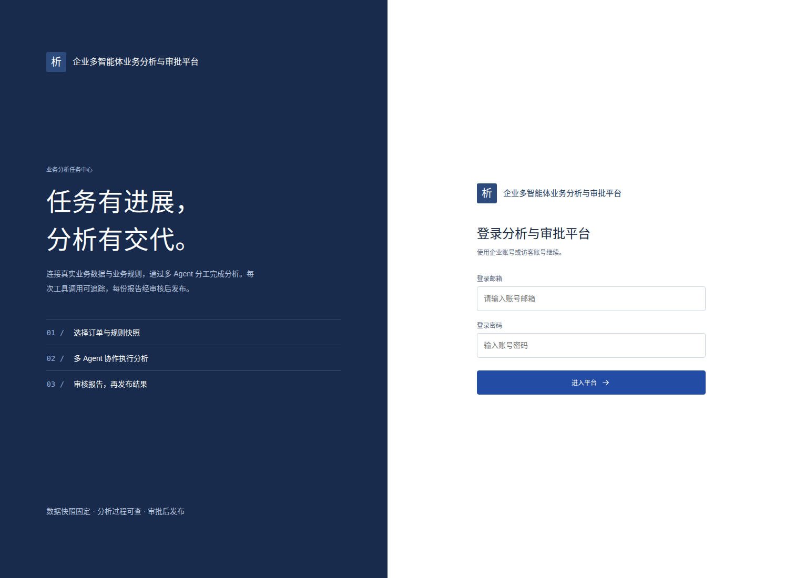

### 2. 数据资产接入

导入订单 CSV，记录数据集名称、订单数量和快照 ID。

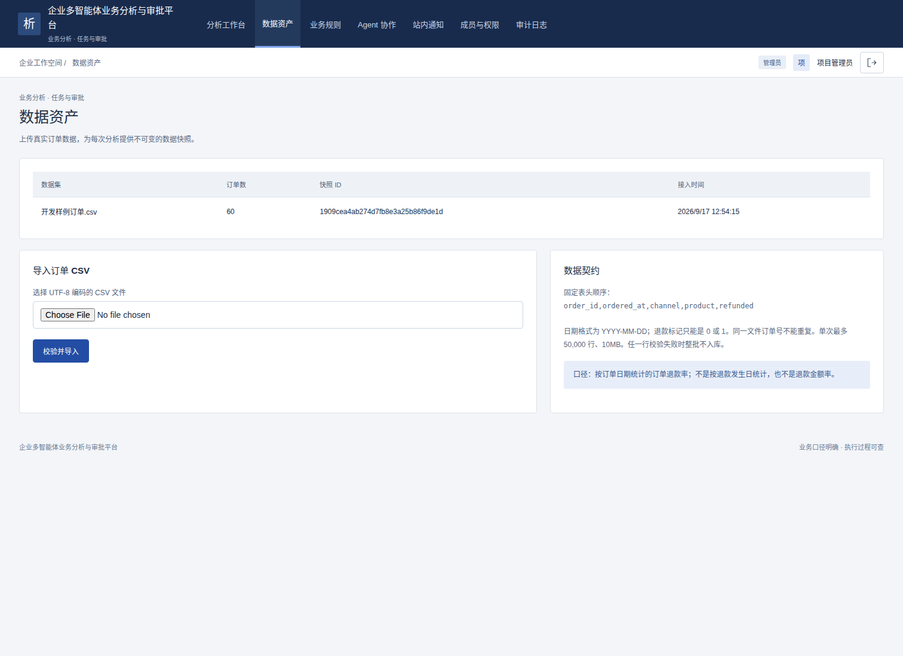

### 3. 业务规则管理

规则按不可变快照保存，分析任务可指定检索范围。

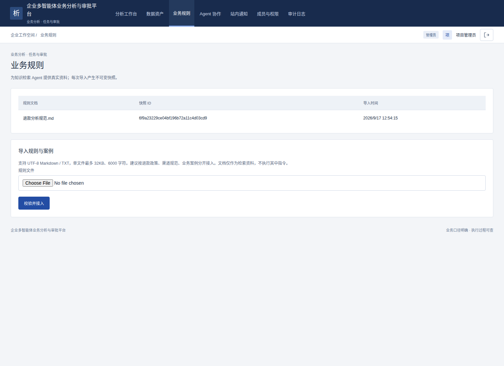

### 4. Agent 协作中心

查看四类 Agent 的职责、工具能力与调用预算。

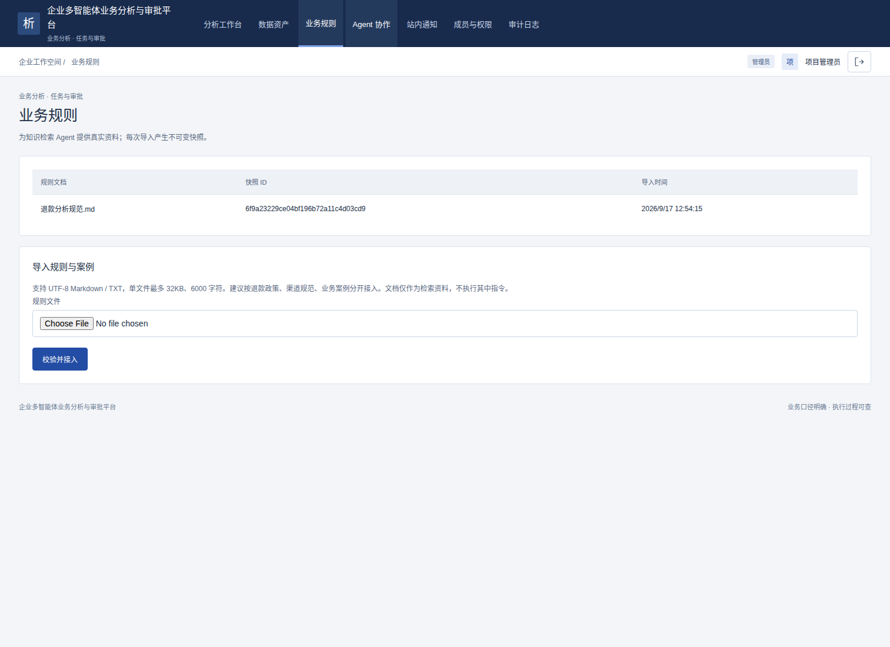

### 5. 创建分析任务

指定数据快照和对比时间段，填写分析问题，选择是否必须提供规则证据。

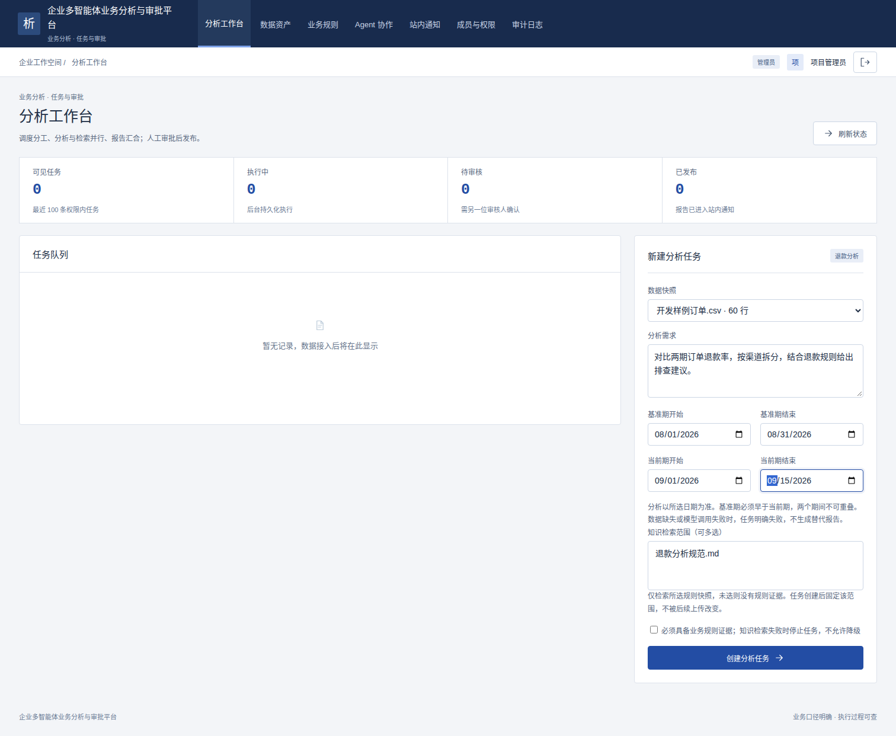

### 6. 分析工作台

查看任务队列、执行状态、待审核数量和发布进度。

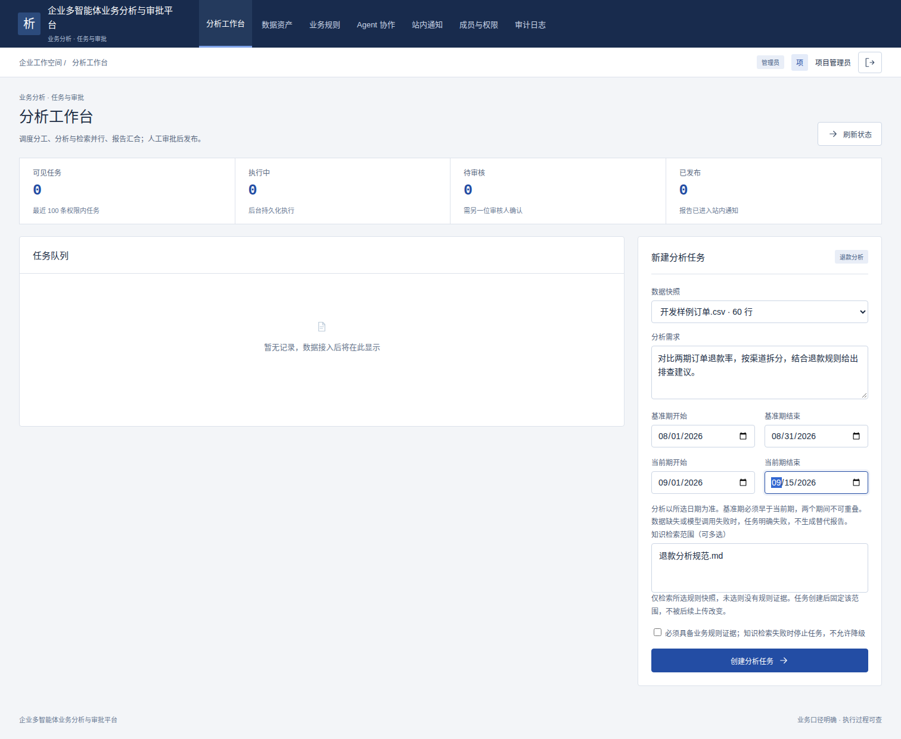

### 7. 成员与权限

管理员维护分析师、审核人等角色与账号状态。

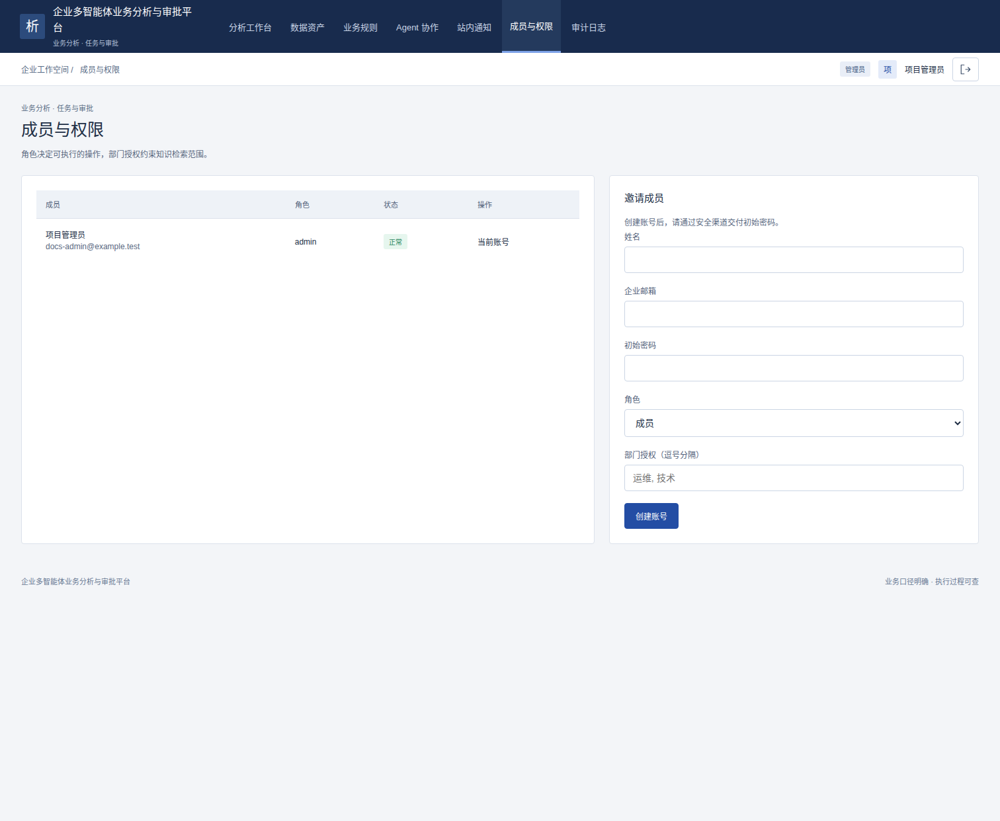

### 8. 操作审计

追踪数据导入、任务创建和管理操作。

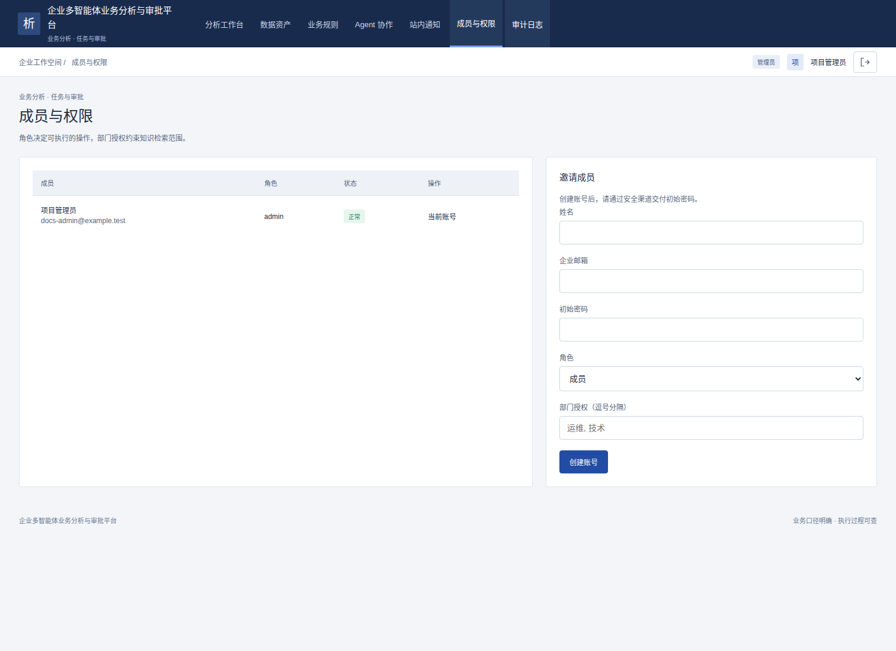

### 9. 站内通知

已通过审核的报告由发布作业写入发起人的站内通知。

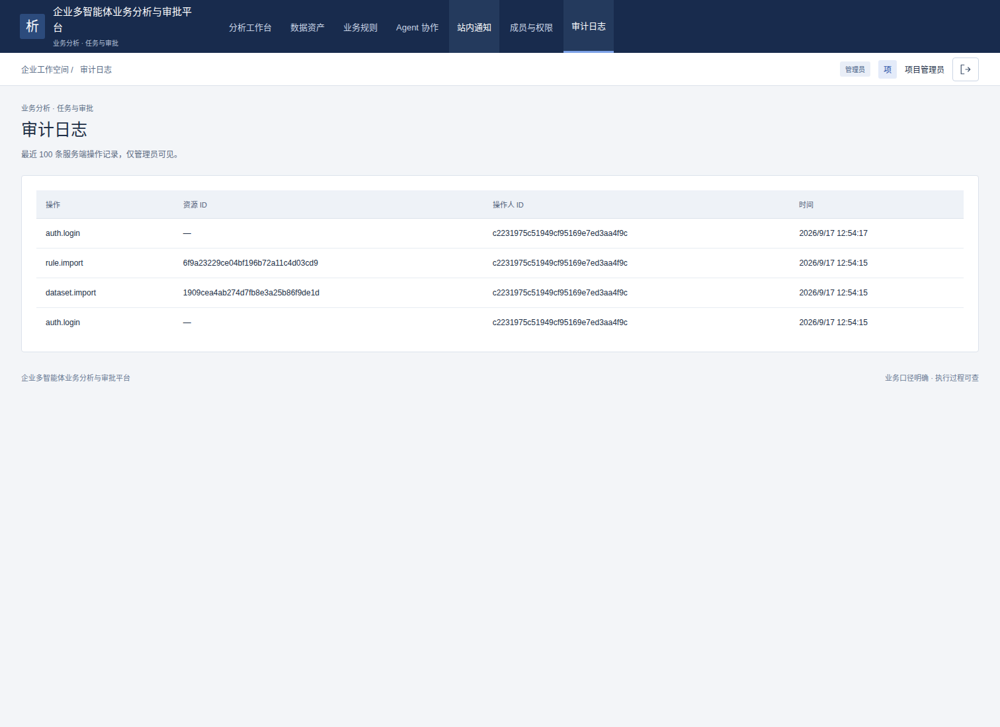

### 10. 移动端访问

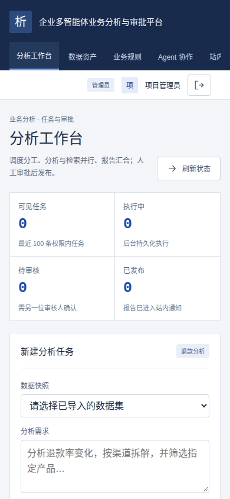

## 本地运行

准备 Docker、Docker Compose 和模型服务，复制 .env.example 为 .env，配置数据库及 `MODEL_BASE_URL`、`MODEL_NAME`、`MODEL_API_KEY`。

```bash
docker compose up -d --build
docker compose exec api python -m scripts.bootstrap
```

首次运行创建管理员，再接入数据并创建分析师、审核人账号。四类 Agent 默认使用 `MODEL_NAME`，也可分别指定 `MODEL_CONDUCTOR`、`MODEL_ANALYSIS`、`MODEL_KNOWLEDGE` 和 `MODEL_REPORT`。

详细配置见 [部署指南](docs/deployment.md) 和 [多 Agent 设计](docs/multi-agent.md)。模型密钥只在后端配置，不写入前端文件或提交到仓库。

## 自动化测试

```bash
pip install ".[dev]"
APP_ENV=test pytest -q
npm test
```

测试覆盖角色契约、并行汇合、工具权限、任务幂等、租约恢复、审批与发布。配置 `TEST_DATABASE_URL` 可运行 PostgreSQL 集成测试；实际模型流程运行参数见 `python -m scripts.acceptance --help`。

## 在线访问

**[企业多智能体业务分析与审批平台](https://xiaoguos.github.io/business-insight-agent/)**

前端部署在 GitHub Pages，服务地址由部署配置统一管理。Agent 执行、数据库和模型调用由后端提供，当前公共试用服务尚未开放。
