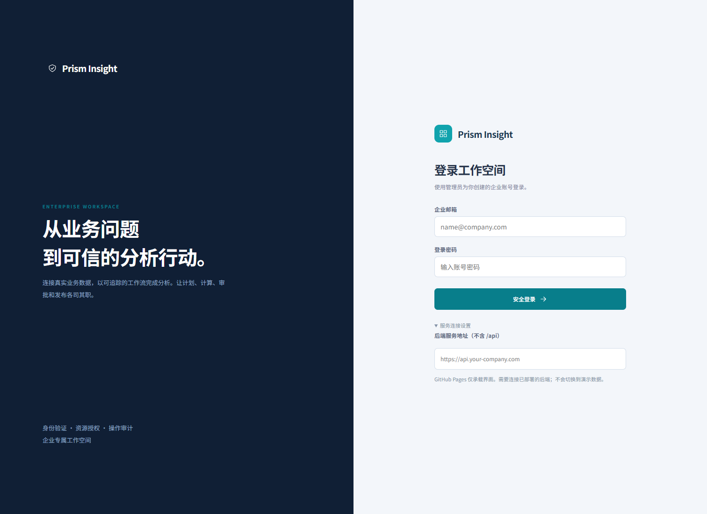
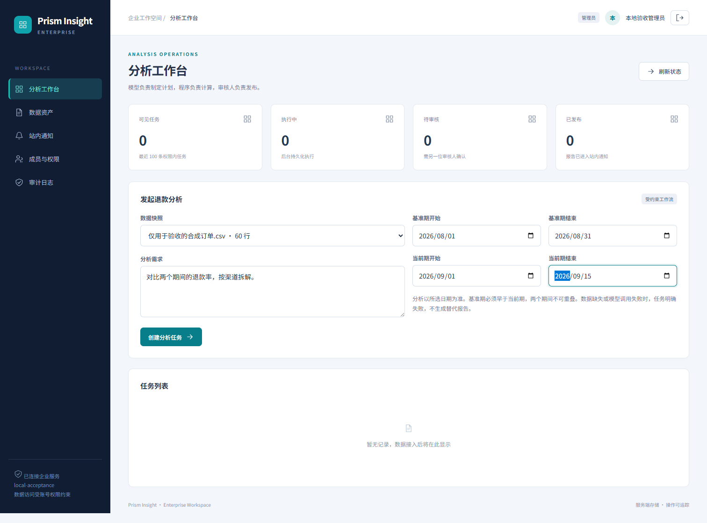

# 截图说明

- production-login.png：此前 GitHub Pages 登录界面的真实截图，早于本次中文品牌与横向任务工作台调整。
- workspace.png：此前本地真实后端验收页面；账号与数据明确标识为验收用途，布局不是最新版。
- phase1-*：旧原型历史截图，不代表当前产品。

生成模型服务尚未配置，因此没有伪造已生成答案/报告的截图。完整截图集和浏览器验收记录独立交付给项目使用者。

## 历史运行记录

登录入口：

分析工作区：

新版截图计划覆盖：登录、订单接入、规则快照、四类 Agent、创建任务、并行执行轨迹、报告生成、异人审批、站内发布、失败重试、权限管理、审计和手机端。模型报告必须在真实模型配置后实际生成才能截图。当前环境阻止浏览器子进程启动，因此新版截图尚未生成。
